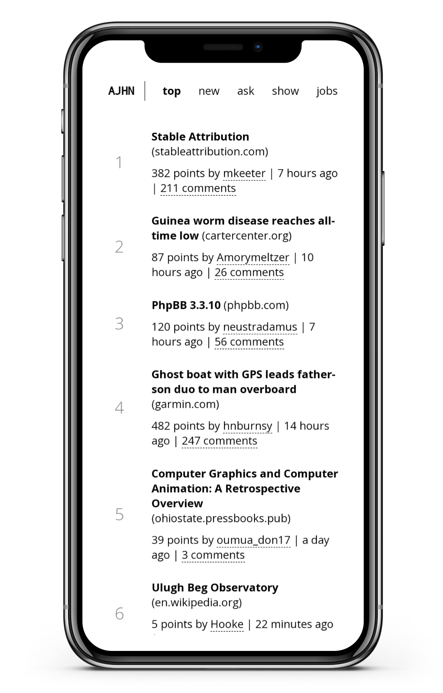

# Hacker News Client

A Hacker News client (PWA) using [Jekyll](https://jekyllrb.com/) and [Alpine.js](https://alpinejs.dev/).



The client is live [here](https://alpinehn.pages.dev).

Read my [blog post](https://salaivv.com/2023/02/07/hacker-news-alpine) on building the client.

## Running locally

You need Ruby and Jekyll installed to run the project locally. Once you have them installed, open the terminal and run these commands:

```bash
git clone https://github.com/salaivv/hacker-news-alpine
cd hacker-news-alpine
bundle
bundle exec jekyll serve --livereload
```

Then you can access the client in your browser at `http://localhost:4000`. Jekyll will build the site and output to the `_site` directory. The `--livereload` flag will make Jekyll regenerate sites as you edit them.

If you want to serve the client in you local network then you can run:

```bash
bundle exec jekyll serve --livereload --host=0.0.0.0
```

Then you can access the client from any device in your network by visiting `http://{IP_TO_YOUR_MACHINE}:4000`.